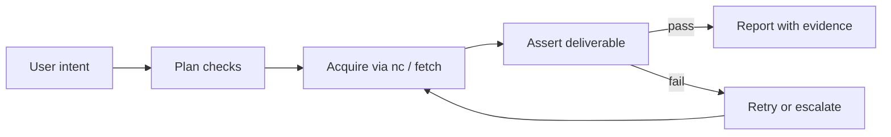

# Deliverable Verification Contract (DVC)

**Status:** v0.1 (2026-05-29)  
**Audience:** Agents using nightCrawl, skill authors, benchmark runners

## Problem

Agents optimize for **command success** (`goto` 200, `pdf` wrote a file). Users optimize for **outcome success** (the right article PDF, logged-in dashboard, submitted form, downloaded CSV).

When those diverge, trust breaks — even if stealth, cookies, and handoff work perfectly.

## Product principle

> **No task is done until the deliverable is verified against user intent.**

Verification is not a nice-to-have QA step. It is the definition of "done" for every browser task.

## UX model (three layers)

| Layer | User question | Agent obligation |
|-------|----------------|------------------|
| **Intent** | What did I ask for? | Restate deliverable type + acceptance criteria *before* long automation |
| **Evidence** | Did I get the real thing? | Produce checkable artifacts (file path, extracted fields, URL, snippet) |
| **Honesty** | If not, what failed? | Report `VERIFY_FAILED` with specific checks — never "I downloaded it" when only `nc pdf` ran |

### Failure copy pattern (user-facing)

```
Could not complete: [user goal]
Done: [what actually worked]
Blocked: [specific check that failed]
Next: [one concrete step — e.g. open Primo record, resolve DOI download URL]
```

## The DVC loop (generalized)

Every task follows **Plan → Acquire → Assert → Announce**:

1. **Plan** — Classify deliverable kind + list 2–5 acceptance checks (see taxonomy).
2. **Acquire** — Use nightCrawl (or HTTP with session cookies) to obtain the deliverable.
3. **Assert** — Run verification (CLI, `nc verify`, or structured checks). **Do not skip.**
4. **Announce** — Tell the user only what passed verification; attach path/URL/snippet.



## Deliverable taxonomy

| Kind | User verbs | Wrong shortcut | Verify with |
|------|------------|----------------|-------------|
| **file-bytes** | download, export, save | `nc pdf`, screenshot | Magic bytes, size, hash; semantic markers in file |
| **publisher-pdf** | download paper, get PDF from library | `nc pdf` on HTML viewer | Crossref/DOI link → `.../download/...`; `nc verify file --kind publisher-pdf` |
| **page-print-pdf** | save page as PDF (explicit) | — | `nc verify file --kind page-print-pdf --allow-browser-print` |
| **page-state** | log in, open dashboard, checkout step | `goto` 200 only | `nc verify page --text-excludes login --text-includes Dashboard` |
| **extracted-data** | scrape, list results, get top 3 | empty `text` / wrong page | Schema + non-empty + spot-check titles/DOIs |
| **action-effect** | submit, add to cart, post | click with no confirmation | Confirmation URL/text/network POST |

## Anti-patterns (hard stops)

| Anti-pattern | Why it fails users |
|--------------|-------------------|
| `nc pdf` for "download from library" | Prints viewport; wrong article, cropped, 1 page |
| `goto` 200 = logged in | Login walls, consent, empty shells |
| Guessing galley URLs from journal homepage | Wrong record (symptom-checker vs browser-automation paper) |
| Announcing success without opening/verifying file | Ship trash deliverables |
| "Downloaded" without byte source | No file on disk or HTML saved as `.pdf` |

## Implementation surfaces

| Surface | Role |
|---------|------|
| **Skill** (`.claude/skills/nightcrawl/SKILL.md`) | Mandatory agent workflow + recipes |
| **CLI** (`nc verify file \| page`) | Machine-checkable assertions |
| **`nc pdf` output** | Warns that output is page print, not download |
| **Benchmarks** | Must call `verify` before recording pass |

## Roadmap (not all in v0.1)

- `nc fetch <url> <path>` — download bytes with browser cookies
- Auto-suggest publisher PDF URL from DOI via Crossref in `goto` flow
- Deliverable manifest in `~/.nightcrawl/activity/` for user audit trail
- Benchmark gate: no `pass` without `VERIFY_OK`

## Related

- Headless persistence: `docs/product-notes/headless-persistence-contract.md`
- UW side-by-side failure case: wrong `nc pdf` artifact renamed `INVALID-nc-pdf-print-wrong-article-do-not-use.pdf`
- Correct publisher PDF example: `artifacts/uw-side-by-side-benchmark/IRJAEH-2026-0046-AI-Agent-with-Browser-Automation.pdf`
